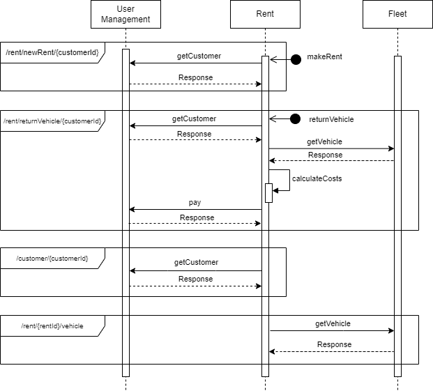

# Υπηρεσία Ενοικίασης Οχημάτων(microservices branch)
Σε αυτό το project γίνεται η αρχιτεκτονική μετάβαση αρχικού branch από μονόλιθο σε microservices  
Φοιτητές: Γεωργιάδης Ελευθέριος(f3312304), Γκίνης Εύαγγελος(f3312303)  
## ΚΑΤΑΝΟΜΗ ΤΗΣ ΛΕΙΤΟΥΡΓΙΚΟΤΗΤΑΣ (ΑΠΑΙΤΗΣΕΙΣ)
- User Management-microservice  
  1.  Κάθε πελάτης που θέλει να ενοικιάσει ένα όχημα θα πρέπει να κάνει αρχικά εγγραφή (όνομα, επώνυμο, email, password, τηλέφωνο, διεύθυνση, αριθμό πιστωτικής κάρτας).
  2.  Κάθε πελάτης μπορεί να ενημερώνει τα στοιχεία του λογαριασμού του.
  3.  Εγγραφή της εταιρείας με χρήση της υπηρεσίας. Κατά την εγγραφή καταχωρείται η επωνυμία, ΑΦΜ, email, password, τηλέφωνο, διεύθυνση, IBAN.
  4.  Κάθε εταιρεία μπορεί να ενημερώνει τα στοιχεία του λογαριασμού της.

- Fleet Management-microservice
  1.  Κάθε εταιρεία διαθέτει κάποια οχήματα. Κάθε εταιρεία καταχωρεί και επικαιροποιεί τα στοιχεία των οχημάτων που διαθέτει προς ενοικίαση. Μεταξύ των στοιχείων του οχήματος περιλαμβάνεται ο τύπος του, το μοντέλο, χρονολογία, κατασκευαστής, τρέχοντα χιλιόμετρα οχήματος, αριθμός κυκλοφορίας και πάγια χρέωση ανά ημέρα.
  2.  Κάθε εταιρεία ορίζει μία ή περισσότερες πολιτικές χρέωσης. Η πολιτική χρέωσης διαμορφώνεται με βάση τον τύπο του οχήματος, τα χιλιόμετρα που έχουν διανυθεί και τις συνολικές ημέρες ενοικίασης. Υπάρχει πάγια χρέωση για κάθε ενοικίαση. Θα υπάρχει κλιμακωτή χρέωση στα χιλιόμετρα. Πχ,τα πρώτα 100χμ χρεώνονται 10λεπτά ανά χιλιόμετρο, τα επόμενα 100 με 15λεπτά ανά χιλιόμετρο, και πάνω από 200 με 20λεπτά ανά χιλιόμετρο.

- Rent-microservice  
  1. Ο πελάτης ενοικιάζει αυτοκίνητα.
  2. Ο πελάτης θα πληρώνει, και η ενοικίαση θα τερματίζει.
  3. Κατά την επιστροφή του οχήματος εκτελείται τεχνικός έλεγχος για να διαπιστωθούν τυχόν ζημιές που έχουν προκληθεί στο όχημα κατά την ενοικίαση. Ο έλεγχος γίνεται από τους τεχνικούς της εκάστοτε εταιρείας ενοικίασης. Στο τέλος θα προκύπτει το κόστος ζημιάς.
  4. Μόλις ο έλεγχος τελειώσει θα υπολογίζεται η τελική τιμή, η οποία είναι πάγιο κόστος + χιλιομετρική χρέωση + κόστος ζημιών.
  
## ΠΕΡΙΓΡΑΦΗ ΤΟΥ ΑΡΙ  
Για το User Management Microservice:  
1. GET /customer/{custId} (Επιστρέφει τον πελάτη με custΙd={custId}
2.	GET /customer (Επιστρέφει όλους τους πελάτες)
3.	PUT /customer (Δημιουργεί νέου customer)
4.	PUT /customer/{custId} (Επεξεργασία των στοιχείων του customer με Id={customerId})
5.	DELETE /customer (Διαγραφή όλων των πελατών)
6.  DELETE /customer/{custId} (Διαγραφή του πελάτη με Id={custId})
7.	GET /company (Επιστρέφει όλες τις εταιρείες)
8.	GET /company/{compId} (Επιστρέφει την εταιρεία με Id={compId}
9.	PUT /company (Δημιουργία νέας εταιρείας)
10.	PUT /company/{compId} (Επεξεργασία των στοιχείων της εταιρείας με Id={custId})
11.	DELETE /company (Διαγραφή όλων των εταιρειών)
12.	DELETE /company/{compId} (Διαγραφή της εταιρείας με Id={compId})

Για το Fleet Management/Charging Policy Microservice:  
1.  GET /vehicle (Επιστρέφει όλα τα οχήματα)
2.  GET /vehicle/{vehicleId} (Επιστρέφει τo όχημα με Id={vehicleId})
3.  GET /vehicle/{vehicleId}/company (Επιστρέφει την εταιρεία για τo όχημα με Id={vehicleId})
4.  PUT /vehicle (Προσθέτει ένα νέο όχημα για την εταιρεία με Id={compId}) 
5.  PUT /vehicle/{compId} (Ενημερώνει ένα όχημα για την εταιρεία με Id={compId}) 
6.  DELETE /vehicle (Διαγράφει όλα τα οχήματα)
7.  DELETE /vehicle/{vehicleId} (Διαγράφει το όχημα με Id={vehicleId})

Για το Rent Microservice:  
1.  GET /rent (Επιστρέφει όλες τις ενοικιάσεις)
2.	GET /rent/{rentId} (Επιστρέφει την ενοικίαση με Id={rentId})
3.	GET /rent/{rentId}/customer (Επιστρέφει τον customer της ενοικίασης με Id={rentId}
4.	GET /rent/{rentId}/vehicle (Επιστρέφει το όχημα για το rent με id=rentId)
5.	GET /rent/{rentId}/technicalCheck (Επιστρέφει τον τεχνικό έλεγχο για το rent με id=rentId)
6.  GET /rent/{rentId}/policy (Επιστρέφει την πολιτική χρέωσης της εταιρείας με Id={compId})
7.	PUT /rent/{rentId} (Ενημέρωση των στοιχείων μιας ενοικίασης)
8.  POST /rent/newRent/{custId} (Υποβολή νέας ενοικίασης (Δημιουργία νέου πόρου Rent))
9.  POST /rent/returnVehicle/{custId} (Επιστροφή νοικιαζόμενου οχήματος)
10.	DELETE /rent (Διαγραφή όλων των ενοικιάσεων)
11.	DELETE /rent/{rentId} (Διαγραφή της ενοικίασης με Id=rentId)

## Περιγραφή της αλληλεπίδρασης των microservices μέσω κλήσεων REST υπηρεσιών  
**Endpoint: /rent/newRent/{customerId}**
Η υπηρεσία Rent καλεί την υπηρεσία Customer κατά την έναρξη μίας ενοικίασης για να επιβεβαιώσει την ύπαρξη το δοσμένου Customer.

**Endpoint: /customer/{custId}/returnVehicle**
Η υπηρεσία Customer καλεί την υπηρεσία Rent για την ολοκλήρωση μίας ενοικίασης. Εσωτερικά, καλείται η “pay” η οποία επικοινωνεί με την υπηρεσία Company.  

**Endpoint: /rent/{rentId}/customer** 
Πλέον, εφόσον κάθε microservice έχει τη δική του βάση δεδομένων, δεν μπορεί να κάνει lookup και να αναζητήσει δεδομένα που δεν της ανήκουν. Άρα, η υπηρεσία Rent για να επιστρέψει έναν πελάτη (για κάποιο rentId) θα πρέπει να επικοινωνήσει με την υπηρεσία Customer.  

**Endpoint: /rent/{rentId}/vehicle**
Ομοίως, η υπηρεσία Rent θα πρέπει να καλέσει τη Fleet για να βρει ένα Vehicle (όχημα) που ζητείται.

## SEQUENCE DIAGRAM

