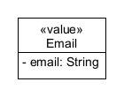

# Υπηρεσία Ενοικίασης Οχημάτων

Στο project αυτό έχει δημιουργηθεί μία υπηρεσία ενοικίασης οχημάτων.

## Λειτουργικές απαιτήσεις

- Η ενοικίαση οχημάτων θα γίνεται από εταιρείες ενοικίασης οχημάτων, με προϋπόθεση την εγγραφή της εταιρείας με χρήση της υπηρεσίας. Κατά την εγγραφή καταχωρείται η επωνυμία, ΑΦΜ, email, τηλέφωνο, διεύθυνση, IBAN.

- Κάθε εταιρεία διαθέτει κάποια οχήματα. Κάθε εταιρεία καταχωρεί και επικαιροποιεί τα στοιχεία των οχημάτων που διαθέτει προς ενοικίαση. Μεταξύ των στοιχείων του οχήματος περιλαμβάνεται ο τύπος του, το μοντέλο, χρονολογία,  κατασκευαστής, τρέχοντα χιλιόμετρα οχήματος, αριθμός κυκλοφορίας και πάγια χρέωση ανά ημέρα.

- Κάθε εταιρεία ορίζει μία ή περισσότερες πολιτικές χρέωσης. Η πολιτική χρέωσης διαμορφώνεται με βάση τον τύπο του οχήματος, τα χιλιόμετρα που έχουν διανυθεί και τις συνολικές ημέρες ενοικίασης. Υπάρχει πάγια χρέωση για κάθε ενοικίαση. Θα υπάρχει κλιμακωτή χρέωση στα χιλιόμετρα. Τα πρώτα 100χμ χρεώνονται 10λεπτά ανά χιλιόμετρο, τα επόμενα 100 με 15λεπτά ανά χιλιόμετρο, και πάνω από 200 με 20λεπτά ανά χιλιόμετρο.

- Κάθε εταιρεία μπορεί να κάνει log in στην υπηρεσία και να βλέπει τα στοιχεία της και να τα επικαιροποιεί τα ίδια της τα στοιχεία (πχ, επωνυμία, email κλπ). Επιπλέον, θα μπορεί να βλέπει το ιστορικό των ενοικιάσεών της, τις τρέχουσες ενοικιάσεις, και τα οικονομικά της στατιστικά.

- Κάθε πελάτης που θέλει να ενοικιάσει ένα όχημα θα πρέπει να κάνει αρχικά εγγραφή (ονο/νυμο, email, password, τηλέφωνο, διεύθυνση, αριθμό πιστωτικής κάρτας).

- Ο πελάτης θα κάνει log in και θα επιλέγει δύο ημερομηνίες (παραλαβής και παράδοσης), και την τοποθεσία ενοικίασης του ώστε να του εμφανίσει τα διαθέσιμα οχήματα για τα οποία θα βλέπει τύπο, μοντέλο, χρονολογία, χιλιόμετρα και την πολιτική χρέωσης και θα επιλέγει όποιο επιθυμεί. 

- Ο πελάτης θα μπορεί επίσης να κάνει log in και να βλέπει το ιστορικό των ενοικιάσεών του.

- Κατά την επιστροφή του οχήματος εκτελείται τεχνικός έλεγχος για να διαπιστωθούν τυχόν ζημιές που έχουν προκληθεί στο όχημα κατά την ενοικίαση. Ο έλεγχος γίνεται από τους τεχνικούς της εκάστοτε εταιρείας ενοικίασης. Στο τέλος θα προκύπτει το κόστος ζημιάς.

- Μόλις ο έλεγχος τελειώσει θα υπολογίζεται η τελική τιμή, η οποία είναι πάγιο κόστος + χιλιομετρική χρέωση + κόστος ζημιών. Ο πελάτης θα πληρώνει, και η ενοικίαση θα τερματίζει.

- Η υπηρεσία θα υπολογίζει στατιστικά στοιχεία για κάθε εταιρεία όπως, μηνιαία έσοδα, κόστη ζημιών, έσοδα ανά τύπο οχήματος, μέση διάρκεια ενοικίασης ανά τύπο οχήματος.

## Παραδοχές

1.	Για να γίνει προβολή των οχημάτων, θα πρέπει κάποιος να έχει γίνει authenticated στην υπηρεσία (basic authentication).
2.	Το κάθε όχημα βρίσκεται στην τοποθεσία της εταιρείας (αυτήν που καταχώρησε όταν εγγράφηκε στην υπηρεσία).
3.	Κατά την επιστροφή του οχήματος, ο πελάτης το επιστρέφει εκεί από όπου το πήρε, δηλαδή στην τοποθεσία της εταιρείας.
4.	Το κόστος ζημιάς θα υπολογίζεται τυχαία (με βάση κάποιο κατώφλι που θα οριστεί manually). Πχ, if random() > 0.8 then calculateDamage(). Αυτή η calculateDamage μπορεί να επιστρέφει έναν τυχαίο αριθμό από 50 έως 150.
5.	Για την πληρωμή, η υπηρεσία θα χρεώνει την πιστωτική κάρτα του πελάτη (σιγουρεύει την εταιρεία να πληρώνεται, και ο πελάτης ασχολείται με την τράπεζα) και θα αυξάνει τα έσοδα της εταιρείας.
6.	Η κάθε εταιρεία θα έχει κάποια έξοδα, πχ αλλαγή λαδιών ή ελαστικών, τα οποία θεωρούμε αμελητέα, δεν αφορούν την υπηρεσία.
7.	Κάθε εταιρεία θα δίνει μία πάγια χρέωση αναλόγως το όχημα που ενοικιάζει. Αυτή η χρέωση μπορεί να είναι όσο θέλει η εταιρεία, αυτή κανονίζει για τα έσοδά της.
8.	Σχετικά με την πάγια χρέωση, κάθε εταιρεία κατά την καταχώρηση των οχημάτων της, θα θέτει η ίδια την πάγια χρέωση ανά ημέρα. Πχ, μια Ferrari, μπορεί να έχει πάγια χρέωση 10€ σε μία εταιρεία, και 100€ πάγια ημερήσια χρέωση σε μια άλλη εταιρεία.
9.	Τα δεδομένα που θα δώσουμε στην υπηρεσία, θα είναι dummy, θα τα φτιάξουμε εμείς.
10.	Η ενοικίαση σε επίπεδο υλοποίησης, δεν θα βασίζεται σε πραγματικές ημερομηνίες συστήματος, αλλά με κάποιο time.sleep. Όταν ένας πελάτης ενοικιάσει για 10 μέρες ένα όχημα, η ακολουθία θα είναι, πχ, rentVechicle(); sleep(10sec); Για αυτόν τον λόγο, θεωρούμε οτι τηρούνται οι ημερομηνίες ενοικίασης, και δεν μπορεί ένας πελάτης να παραδόσει το όχημα εκπρόθεσμα.
11.	Θα εισάγουμε συγκεκριμένο πλήθος περιοχών (πχ, 10 πόλεις) για λόγους απλότητας.
12.	Επειδή δεν ξέρουμε πόσα χιλιόμετρα εν τέλει θα διανύσει ο πελάτης, θα έχουμε μια random συνάρτηση για να μας δίνει τον αριθμό των χιλιομέτρων. Μετά από κάθε ενοικίαση οχήματος θα γίνεται και ενημέρωση στη βάση δεδομένων που είναι καταχωρημένα τα στοιχεία του αντίστοιχου οχήματος.
13.	Θεωρούμε ότι η κλιμακωτή χρέωση των χιλιομέτρων είναι σταθερή για όλες τις εταιρείες (όλες το βάζουν στην πολιτική τους).
14. Για τον υπολογισμό της ζημιάς δε μας ενδιαφέρει το είδος και η περιγραφή της ζημιάς, παρά μόνο το κόστος σαν τιμή.
15. Οι τύποι των οχημάτων θα είναι μόνο αυτοκίνητα στις ακόλουθες κατηγορίες: SUV, Hatchback, Sedan, Mini, Cabrio.
16. Επειδή θεωρήσαμε οτι μία ενοικίαση τρέχει με sleep function (πχ, 10 δευτερόλεπτα), όταν μια εταιρεία κοιτάζει τις τρέχουσες ενοικιάσεις της, μπορεί να μην προλαβαίνει να τις δει όλες. Αυτό αντιμετωπίζεται με το να βάλουμε περισσότερα δευτερόλεπτα στο sleep function.
17. Θεωρούμε οτι το νόμισμα με το οποίο γίνονται οι πληρωμές στο πρόγραμμα είναι EUR ή USD (για λόγους απλότητας θα χρησιμοποιείται το EUR στα δεδομένα μας, αλλά θα υπάρχει και δυνατότητα μετατροπής, εαν αυτή προκύψει).

## Τεκμηρίωση

Για την τεκμηρίωση του λογισμικού χρησιμοποιήθηκε το Markdown markup για τη συγγραφή των κειμένων και το εργαλείο UMlet για την κατασκευή των διαγραμμάτων UML.

## Domain Model (Class Diagram)

